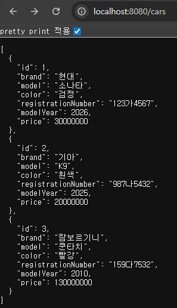
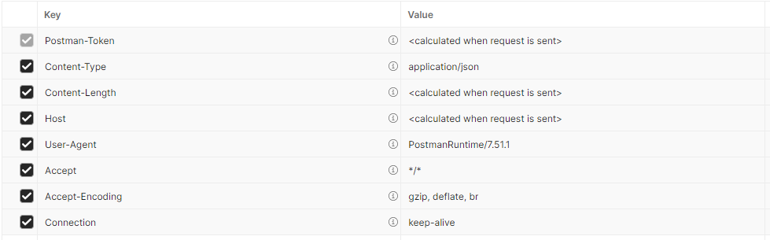
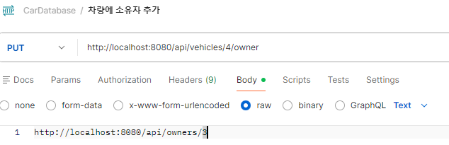

5. 'spring.jpa.ddl-auto' 설정은 데이터베이스 초기화의 작동 방식을 정의한다.
  - none : 대부분의 DB에서의 기본값

# cardatabase2 생성

# RESTful 웹 서비스 만들기
웹 서비스란 HTTP 프로토콜을 이용하여 인터넷을 통해 통신하는 애플리케이션을 의미합니다. 웹서비스

## REST 기초
- Relational State Transfer의 축약어<br>
웹 서비스를 제작하기 위한 아키텍처 스타일. rest는 특정 언어나 플랙폼에 의존적이지 않으면서 
~~ 확장성이 높다.

- 하지만 RESTful이 특정한 표준이나 프레임워크는 아니고 로이 필딩이란느 개발자가 제시한 제약조건들의 집합에 해당한다.

1. 상태 비저장 : 서버는 클라이언트 상태에 대한 어떤 정보도 저장하지 않아야 한다.
2. 클라이언트 - 서버 간 독립성 : 클라이언트와 서버는 독립적으로 작동해야한다. 그리고 서버는 클라이언트의 요청없이는 어떠한 정보도 전송해서는 안된다.
3. 캐시 기능 : 여러 클라이언트가 동일한 리소스를 요청하는 경우가 많으므로 성능 향상을 위해 리소스에 캐싱을 적용해야 한다.
4. 일관된 인터페이스 : 서로 다른 클라이언트에 의한 요청이더라도 응답은 동일하게 보여야 한다.
5. 계층형 시스템 : 전체 서비스에 영향을 주지 않고 구성요소를 추가하거나 수정할 수 있어야 한다.
6. 주문형 코드 : 선택적인 제약 조건에 해당. 대부분의 서버는 정적 컨텐츠를 JSON또는 XML 형식으로 전송하는데, 필요한 경우 컨텐츠 자체가 아니라 실행 코드도 전송할 수 있어야 한다.

특히 일관된 인터페이스는 중요한 제약 조건에 해당하기 때문에 REST 아키텍처에 이하의 요소가 들어갈것을 요구한다.

1. 리소스 식별 : 리소스는 고유 식별자(예 : 웹 기반 REST서비스의 URI)로 식별해야한다.<br>
REST 리소스는 이해하기 쉬운 디렉토리 구조의 URI를 노출해야 한다. 즉, 이름을 잘 지어야 한다.
2. 표현을 통한 리소스 조작 : 리소스를 요청할 때 서버는 리소스의 표현으로 응답해야한다. 일반적인 표현 형식으로는 JSON/XML이 있다.
3. 자체 설명적인 메시지 : 메시지는 서버가 처리 방법을 알 수 있는 충분한 정보가 포함되어야 한다.
4. HATEOAS : Hypermedia As The Engine of Application State 서버가 클라이언트에게 하이퍼 미디어를 통해 정보를 동적으로 제공해주는 것<br>
응답에는 서비스의 다른 영역으로 연결되는 링크가 포함되어야 함 -> json 내부에 다른 링크 URI가 있어서 서로 연결 된다는것을 으미ㅣ

## RESTful 웹 서비스 만들기
- SpringBoot 상에서 모든 HTTP 요청은 contorller 클래스로 처리된다.
- domain 패키지와 동일한 수준에 controller 패키지 생성
- controller 패키지 내부에 CarContorller 클래스 생성

```java
package  com.korit2.cardatabase.controller;

//import org.sp

@RestController
public class CarController {
    @GetMapping("/cars")
    public List<Car> getCars(){
        //자동차를 검색하고 return하는 로직
    }
}
```

`@GetMapping("/cars")` : 는 localhost:8080/cars uri로 들어갔을 경우 getCars()라는 메서드가 호출될 수 있도록 경로를 설정한 것이라고 볼 수 있다.<br>
특히 이상의 코드에서 모든 자동차 객체가 List 형태로 retrun 되는것을 알 수 있는데 `@RestController`와 `@GetMapping`으로 인해 Java List로 리턴된 것이 자동으로 Json 객체로 변환된다.<br>
이상의 코드는 GET 요청만 처리할 수 있도록 되어있다. 그렇다면 `@PostMapping , @DeleteMapping , @PutMapping`등도 있다.

- 그렇다면 Car는 어디에 저장되어 있는가 -> db에
- 어떻게 접근하는가 repository 클래스를 경유한다.
- 즉, carController가 carRepository를 가져온다.

- 그렇다면 Car 객체들을 가져와야 한다는건데, 어디서 가지고 오나? DB에서
- Springboot에서 DB에 접근하는 애는 누구다? -> repository
- 그래서 이하의 코드를 확인했을때, CarRepository를 자료형으로 하는 field인 carRepository를 정의했고, 그것의 .findAll()메서드를 호출하여 결과값을 가지고 왔다. -> .findAll은 extend로 받았다.

```java
package  com.korit2.cardatabase.controller;

import com.korit2.cardatabase.domain.Car;
import com.korit2.cardatabase.domain.CarRepository;
import lombok.RequiredArgsConstructor;
import org.springframework.web.bind.annotation.GetMapping;
import org.springframework.web.bind.annotation.RestController;

import java.util.List;

@RestController
@RequiredArgsConstructor
public class CarController {

//    public CarController(CarRepository carRepository) {
//        this.carRepository = carRepository;
//    } @Require~이 있으면 없어도 된다.

    private final CarRepository carRepository;
    @GetMapping("/cars")
    public List<Car> getCars(){
        //자동차를 검색하고 return하는 로직
        return carRepository.findAll();
    }
}

```



## Spring Date REST tldudglr;
- Spring Data REST는 스프링 데이터 프로젝트의 일부이다.
- 스프링으로 RESTful 웹 서비스를 빠르게 구현해주는 방식이다. 그리고 HATEOAS도 지원한다.

- build.gradle에 의존성 추가
```java
// Spring Data REST 의존성 추가
	implementation 'org.springframework.boot:spring-boot-starter-data-rest'
```

- application.properties에 basePath 설정

```java
spring.data.rest.basePath=/api
```
근데 아무 문제가 없어도 white 라벨이 나올 수도 있다.<br>
postman이라는 외부 프로그램을 사용한다.<br>
chrome에서 postman 검색해서 설치 -> GET 요청으로 localhost:8080/api/cars를 날렸을때 자동차 목록이 JSON형태로 나오면 성공

여기서 Spring Data REST의 장점은 이하와 같다.
1. CarController를 날렸을넨 getCars()메서드를 요청한것과 동일한 결과값이 나온것
2. getCars()만 있고, getCar(int id)가 없으나 자동차 하나를 return하는 메서드가 알아서 정의 되어 있다는것
3. Owner 쪽은 손도 안댔는데 getOwnerts와 getOwner가 다 존재한다는점.<br>
즉, Controller에 해당하는 

### CRUD를 일단 postman 에서 실행해보가
스프링 데이터 REST는  모든 CRUD 작업을 제공한다
HTTP | CRUD 
-----|----
Get | 읽기
POST |생성
Put, patch|업데이트
Delete|삭제(delete)

1. 삭제 : delete 요청을 날려야하는데, 전부 다 삭제하고 싶은게 아니라면 특정 차를 삭제해줘야 한다. 그렇다면 특정 차라는 것을 확인할 수 있는 방법은? -> pk값
  - localhost:8080/api/cars/1 URI로 DELETE 요청을 날려야 한다.
  - 특정한 ID값을 가진 애를 기준으로 삭제하기 때문에 call3() 유형의 메서드를 가지게 된다. 매개변수 있음, 리턴 없음  

2. 생성 : POST 요청해야 한다. 잘 생각해봐야 할 점은 POST 요청을 한 시점에는 DB에 차가 있을까 없을까가 문제
-> 아직 없는 상태, 왜?<br>
우리는 DB에서 ID값을 가져오기 때문에 POST 요청을 하는 시점에는 당연히 고유값 역할을 하는 ID가 없을거다. 그러면 생성 이후에 ID가 할당이 된다고 생각할 수가 있겠다.
  - http://localhost:8080/api/vehicles


  - create 상황에서 중요한점은 content-Type : application / json이어야 한다는 점이다.
  - 우리 이름으로 owner 하나를 post해보시오

3. 수정 : PUT / PATCH로 나뉜다. put을 사용하는 경우에는 전체 key-value를 다 입력해야하고, Patch를 사용하는 경우에는 수정할 부분의 key-value를 다 입력해야하고, Pat

```json
{
    "color" : "검정"
}
```

- 근데 tesla를 만든것이야 좋다만 owner가 null이다.
- put method로 적용해보겠다.

- url : http://localhost:8080/api/vehicles/4/owner
- text : Coontent-Type : text/uri-list
- content : http://localhost:8080/api/owners/쓰고싶은 아이디


- put 매핑이 patch 매핑보다 자주 일어난다.

- 그런데 DB상에서의 ID값을 사용자들은 알 수 없다. 자기 차량 정보를 수정하기 위해서는 기본적으로 id 값이 있어야 할 것 같은데 사용자들이 알지 못한다면 문제가 있을 수 있다.

- Brand 명 등을 통한 검색으로 특정 자동차 정보를 가지고 올 수 있어야 할것이다.

postman에서 GET http://localhost:8080/api/vehicles를 검색했을때, 맨 마지막에 `http://localhost:8080/api/vehicles/search`가 추가된 것을 확일할 수 있다.

즉 인터페이스에 커스텀 추상 메서드를 추가했고, 이것을 postman이나 백엔드 api에서 적용하기 위한 방법을 학습한 것이다.

### 과정
1. Repository 클래스에 `@RepositoryRestResource`를 추가한다.
아까 endpoint 경로를 바꿀때 사용했다.

2. 쿼리 매개변수에 `@Param`을 추가했다.

```java
package com.korit2.cardatabase.domain;
import org.springframework.data.jpa.repository.JpaRepository;

import org.springframework.data.jpa.repository.JpaRepository;
import org.springframework.data.jpa.repository.Query;
import org.springframework.data.repository.CrudRepository;
import org.springframework.data.repository.PagingAndSortingRepository;
import org.springframework.data.repository.query.Param;
import org.springframework.data.rest.core.annotation.RepositoryRestResource;

import java.util.List;

@RepositoryRestResource(path = "vehicles") //이름교체의 의미?
public interface CarRepository extends JpaRepository<Car, Long> {
    List<Car> findByBrand(@Param("brand") String brand); // brand로 자동차 검색
    List<Car> findByColor(@Param("color") String color); // color로 자동차 검색

    List<Car> findByModelYear(int modelYear);

    List<Car> findByBrandAndModel(String brand, String model);

    List<Car> findByBrandOrColor(String brand, String color);

    List<Car> findByBrandOrderByModelYearAsc(String brand);

    @Query("select c from Car c where c.model = ?1")
    List<Car> findByModel(String model);

    @Query("select c from Car c where c.brand like %?1")
    List<Car> findByBrandEndWith(String brand);

}
```

- 그런데 우리는 하나하나 만들고 있으니까 그렇다고 치는데 항상 협업이 전제가 되어야 한다.
- 특정 api가 어떤 기능을 한다는 것을 명시하는 것이 api 명세서라는 개념이다.